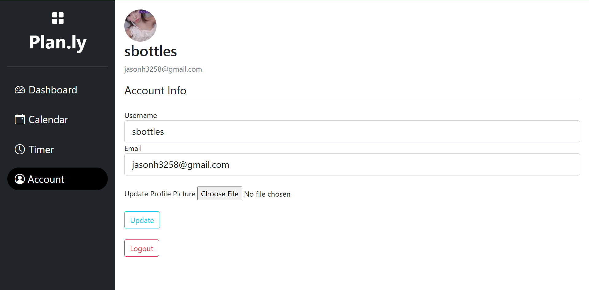
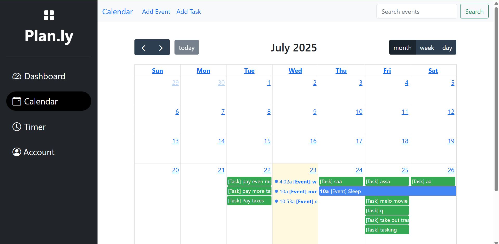
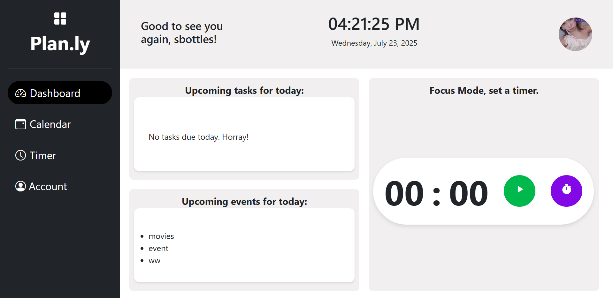
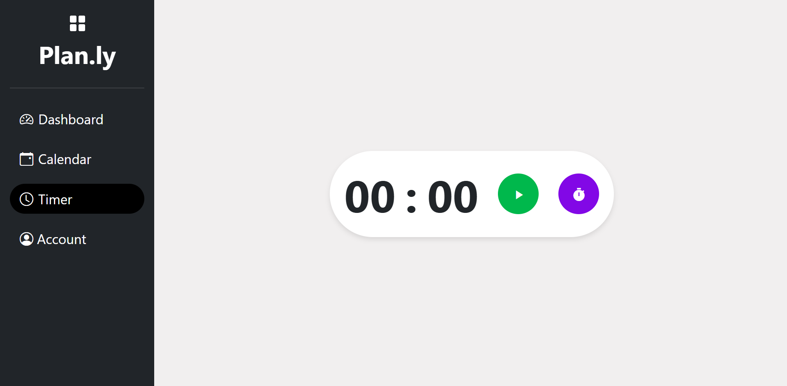

Description:

A full-stack web application to help students manage their study schedule.
Features include a calendar, timer, task/event management, and user account system.

Features:
✅ User Registration/Login (with secure password hashing)

📆 FullCalendar-based dynamic calendar

⏱️ Pomodoro-style Timer for focused study

✅ Add/Edit/Delete Tasks and Events

🧑‍💻 Account Management with profile picture upload

📦 SQLAlchemy ORM + SQLite Database

📧 Password Reset via Email (Flask-Mail)

🎨 Clean UI with Bootstrap 5

Structure:
flaskplanner/
├── error/
│   ├── __init__.py
│   └── handlers.py
├── main/
│   ├── __init__.py
│   └── routes.py
├── user/
│   ├── __init__.py
│   ├── forms.py
│   ├── routes.py
│   └── utils.py
├── task/
│   ├── __init__.py
│   ├── forms.py
│   └── routes.py
├── templates/
│   ├── account.html
│   ├── addevent.html
│   ├── addtask.html
│   ├── base.html
│   ├── calendar.html
│   ├── errors/
│   │   ├── 403.html
│   │   ├── 404.html
│   │   └── 500.html
│   ├── formlayout.html
│   ├── home.html
│   ├── layout.html
│   ├── login.html
│   ├── register.html
│   ├── reset_request.html
│   ├── reset_token.html
│   └── timer.html
├── static/
│   ├── main.css
│   ├── script.js
│   ├── script2.js
│   └── profile_pics/
│       └── *.jpg (default/user-uploaded profile pics)
├── models.py
├── config.py
├── run.py
├── .env
├── .gitignore
├── requirements.txt
├── README.md
└── migrations/
    ├── README
    ├── alembic.ini
    ├── env.py
    ├── script.py.mako
    └── versions/
        └── *.py (migration files)

Used: 
Flask + Jinja2
Bootstrap 5 + FullCalendar
JavaScript (for timer & flash message behavior)
SQLAlchemy
Flask-WTF
Flask-Mail
Alembic (for DB migrations)

🚀 Getting Started
Copy .envexample to .env and fill in your own values.
1. Clone the repo:
2. Create a virtual environment and activate it:
3. Install dependencies and necessaru pip installs
        pip install flask
        pip install flask_sqlalchemy
        pip install flask_login
        pip install flask_wtf
        pip install email-validator        
        pip install flask_mail
        pip install itsdangerous           
        pip install python-dotenv          
        pip install flask_migrate    
        pip install flask_bcrypt           # if using bcrypt for password hashing
        pip install pytest                 # for testing (if needed)      
4. Create your own`.env` file:
 - Copy `.envexample` to `.env`
 - Add your secret keys, DB URI, email config, and password
5. Run the app in terminal: (your folders/path)/flask_planner -> python run.py 

🖼️ Screenshots

🔐 Register Page

👤 Account Page

📆 Calendar Page

✅ Dashboard

⏱️ Timer

Made by: Seojin Hyun

www.linkedin.com/in/seojin-hyun-101b70310
📧 jasonh3258@gmail.com